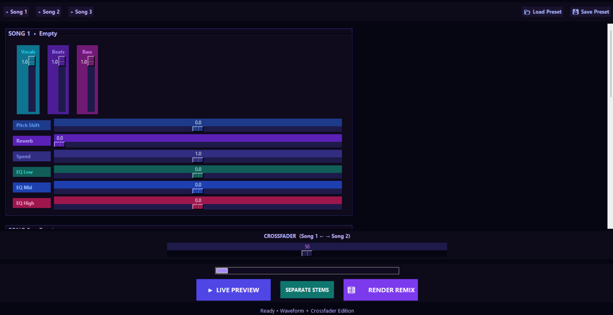
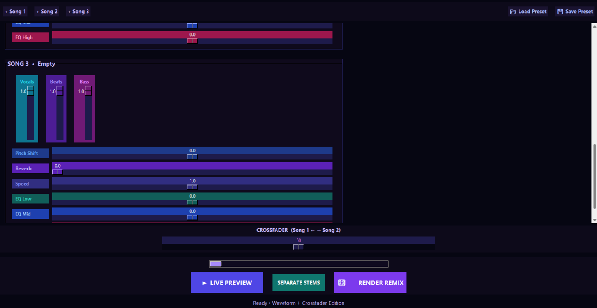

# Neon Mashup Studio

**Multi-Track AI-Powered Song Mashup Studio with Beatmatching**


A powerful tool for creating mashups by loading 2–3 songs and mixing them with independent control over vocals, beats, bass, pitch, reverb, speed, EQ, and **automatic beatmatching**.

**Current Focus:** Web interface (Gradio) development. The desktop app (Tkinter) is frozen as of v1.0.

---

## Features

- **Load up to 3 songs** with automatic BPM detection
- **Beatmatching** — automatically align beat grids across tracks
- **Master volume per song** — isolate any single song's stem mix or blend all three
- **Independent stem controls** — Vocals, Beats, Bass, Other (via AI separation)
- **Per-song effects** — Pitch shift, Reverb, Speed, 3-band EQ (Low/Mid/High)
- **Crossfader** — balance Song 1 and Song 2
- **Target tempo** — stretch all tracks to a common BPM
- **Live preview** — render a 60-second sample in real-time
- **Preset system** — save/load your favorite mixer settings as JSON
- **Stem separator** — use Demucs to isolate vocals, drums, bass, and other instruments
- **Web interface (Gradio)** — modern browser-based interface with full feature set

---

## Screenshots





---

## Tech Stack

- **Python 3.10+**
- **Tkinter** (desktop) / **Gradio** (web) – GUI
- **FFmpeg** – audio mixing and effects
- **Demucs** – AI stem separation
- **Librosa** – automatic BPM detection and beat anchor analysis
- **NumPy** – numerical processing

---

## Installation

1. Clone the repository:

```bash
git clone https://github.com/codewithpb11/neon-mashup-studio.git
cd neon-mashup-studio
```

2. Create and activate a virtual environment:

```bash
python -m venv .venv
.venv\Scripts\activate      # Windows
source .venv/bin/activate   # macOS/Linux
```

3. Install dependencies:

```bash
pip install -r requirements.txt
```

4. Ensure FFmpeg is installed and in your system PATH:
   - **Windows**: [ffmpeg.org](https://ffmpeg.org/download.html)
   - **macOS**: `brew install ffmpeg`
   - **Linux**: `sudo apt-get install ffmpeg`

---

## How to Use

### Web Version (Gradio)

```bash
python3 gradio_app.py
```

Opens a browser interface at `http://localhost:7860`.

1. Load up to 3 songs with **Load** buttons — BPM detection starts automatically.
2. Click **SEPARATE STEMS** to isolate vocals, beats, bass, and other instruments.
3. Adjust **Master Volume** and **Stem Levels** (Vocals, Beats, Bass, Other) for each song.
4. Use **Effects** sliders (Pitch Shift, Reverb, Speed, EQ) to shape each track.
5. Use the **Crossfader** to blend Song 1 and Song 2.
6. (Optional) Set a **Target Tempo** and enable **Beatmatch** to sync all tracks.
7. Click **▶ LIVE PREVIEW** to hear a 60-second sample.
8. Click **🎛️ RENDER REMIX** to generate the final full-length output.
9. Use **Presets** to save/load your mixer settings.

> **Note:** The desktop version (Tkinter) is archived as of v1.0. See `archive/` for the frozen version.

---

## Advanced Features

### Beatmatching

1. Load two or more songs.
2. Let BPM detection finish (status shows in the song panel).
3. Set a **Target Tempo (BPM)** — all tracks will be time-stretched to this tempo.
4. Enable **Beatmatch** — beat grids will automatically align.
5. (Optional) Use **Beat Phase Offset** (Song 2 & 3 only) to nudge the alignment if the default doesn't feel right.

### Stem Separation

1. Click **SEPARATE STEMS** — this runs Demucs (takes 2–5 minutes per song).
2. Once complete, the **Vocals / Beats / Bass / Other** faders become active for precise control.
3. Set any stem volume to 0 to mute it entirely.

### Presets

Save and load your mixer configuration:

```bash
# Desktop version
💾 Save Preset → enter a name → saved to presets/my_mashup.json

# Web version
Preset Name field → Save Preset button
```

Presets are JSON files and work across both desktop and web versions.

---

## Disclaimer

This tool is created for educational and creative purposes only. Please only use audio files that you own or have proper rights to use. The developer is not responsible for any copyright violations by users.

---

## Author

**Pramit Baksi**  
2nd Year B.Tech Student, Computer Science & Engineering  
Kolkata, West Bengal, India

---

## License

This project is licensed under the MIT License. See the [LICENSE](LICENSE) file for details.

---

## Future Plans

- Better UI polish for the web version (custom theming)
- Real-time waveform visualization in the web interface
- Mobile application
- Advanced beat-grid editing (bar-level alignment, not just beat-level)
- A/B comparison mode for quick mashup iteration
